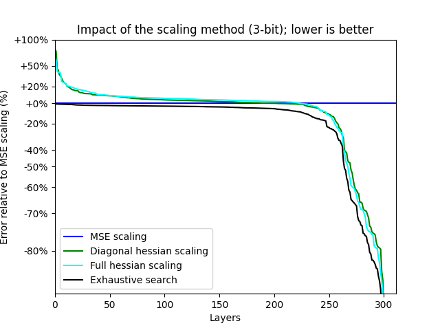
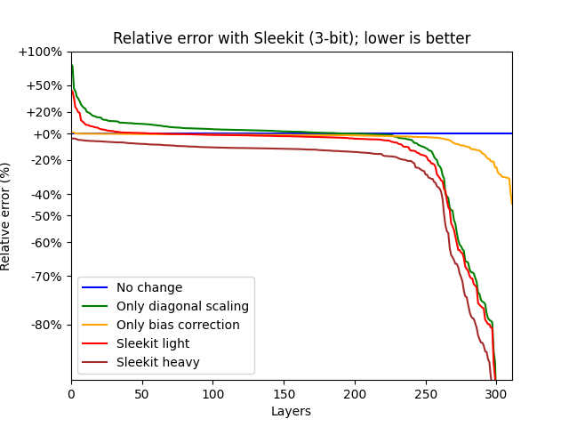

# Bag of Tricks for NN Quantization

Neural network quantization is the process that compresses the weights in a neural network to use a smaller number representation.
This makes its representation smaller, both on disk and in memory, and can make the computation less expensive for accelerators, typically by using small integer weights for the coefficients.
At the same time, it reduces the precision of the computations, so that good algorithm design is necessary to maintain good quality.

This repository contains tools to research post-training neural networks quantization, with methods to improve over the current state-of-the-art.
It is purely for analysis purpose: complete implementations will be made available on other repositories.
Our main contributions are two simple improvements that are compatible with most quantization methods: an improved scaling method, and making better use of the bias during quantization.

## Quantization method

Sleekit uses a very generic quantization method. The steps to quantize a layer are:
* gathering sample data: we run the network on some data samples to gather statistical informations for each layer;
* chosing of a codebook: a codebook gives a limited number of values that can be represented, and we round the weights to one of the values in the codebook;
* scaling the weights: we apply a scaling factor so that the weights are close to the chosen codebook;
* optimizing the weights: to maintain a good quality for the neural network, we use a specialized algorithm to tweak the weights after rounding.

## Improvements

We present two generic improvements that can be applied to any quantization method.
One targets the scaling step, and allows to select better scaling factors. The other targets the weight optimization step, and can significantly reduce the layer error.

## Methodology

To develop our methods we analyze the effect of quantization decisions on a per-layer basis.
Since post-training quantization operates at the layer level, this gives us a much more precise view of quantization behaviour than network-level metrics, and allows for rapid iteration.

Our baseline for comparison is the [GPTQ](https://arxiv.org/abs/2210.17323) algorithm with 3-bit and 1.5-bit weights.
For the layer weights and metrics, we use layer statistics from a full accuracy run on several smaller networks (OPT-125M, OPT-350M, BLOOM-560M).
We compare the error introduced by the quantization with and without our methods.

### Trick 1: better scaling

A good scaling factor minimizes the error introduced by quantization.
The typical method is to chose a scaling factor that minimizes the mean squared error on the weights (MSE).
We introduce a more precise approach, that optimizes the layer's result directly.

For weight optimization, we already have access to an accurate measure of the layer's error (the hessian matrix $H$ obtained from input samples).
Our idea is to reuse it for scaling optimization.
We test three different approaches to scaling, and compare the layer error after applying GPTQ:
* minimizing the mean squared error after rounding to the nearest;
* using the full hessian matrix to compute the error, which is computationally expensive;
* using the diagonal of the hessian matrix to compute the error, which has the same computational cost as the MSE;
* using the full weight optimization to compute the error for each scaling value, which is extremely expensive but is theoretically optimal.

The usual approach of minimizing the MSE yields results that are far from optimal.
Using the full hessian matrix or its diagonal yields similar results that are on average much better than MSE alone.
However, they are still far from the theoretical optimum of integrating the weight optimization algorithm with the scaling method.

### Trick 2: adding bias correction

[Bias correction](https://arxiv.org/abs/1810.05723) is a method used to reduce the impact of quantization on a layer.
Newer quantization methods behave much better, and it is not used much anymore.
However, it is compatible and there is no reason not to use both.
The effect of bias correction can even be integrated in the cost function used for weight optimization, using $H=\frac{1}{n} X^\intercal X -M^\intercal M$, where $X$ are the input samples and $M = \frac{1}{n}1^\intercal X$ is the average value of the samples for each input.

We test three different ways to update the bias:
* applying weight optimization alone (GPTQ) without bias correction;
* applying bias correction after weight optimization, yielding a slightly smaller layer error;
* taking the effect of bias correction into account during weight optimization.

Adding back bias correction greatly improves certain layers, in particular some attention layers in all networks.
While it is always an improvement in theory, bias correction can play havoc with the optimization algorithm, and taking it into account during weight optimization is sometimes detrimental.
Adding bias correction after optimization, or picking the best of the two results, is always better than the baseline.
Unsurprisingly, it has more impact with a more agressive quantization.

### Minor tricks

We obtain a small improvement by modifying the ordering used for the GPTQ algorithm in weight optimization. GPTQ uses the weights on the diagonal of the matrix, but multiplying them by the sum of squares of the quantization error (without correction) yields a small but significant improvement.

### The many tricks that do not work

The following approaches did not yield promising results and were abandoned:
* Improved codebooks: the data is far from being gaussian-distributed, but training a codebook naively is not better than a NF4 codebook. A good codebook training would take the importance of individual weights in the layer into account.
* Entropy coding: it is tempting to combine codebook optimization with entropy coding to reduce storage needs. However, the gain in entropy is not huge compared to an error-optimized codebook, and does not seem worth the effort.
* GPTQ reordering: clever heuristic orderings for GPTQ based on the hessian matrix do not bring a reduction in layer error, compared to using its diagonal as the original paper does. We tested several variations using the diagonal of the inverse and pivoted Cholesky decompositions.
* More complex algorithms for weight optimization: it just doesn't scale, but if you want to go in this direction you probably want to use the [MQLib](https://github.com/MQLib/MQLib) as a solver.

### Putting it all together

Finally, we put all these algorithms together in Sleekit.
The hessian matrix is modified to represent the effect of bias correction.
Scaling is performed based on its diagonal, and weight correction uses our slightly improved ordering.
The computational cost of the algorithm is not increased, and there are many ways to improve the quality of the results for a penalty in quantization time.
For example we could run several of the above methods and pick the best.

The various tricks interact well, and their benefits seem to stack.

## References

The algorithms in this repository build on the following works:
* [Bias correction](https://arxiv.org/abs/1810.05723) and [GPTQ](https://arxiv.org/abs/2210.17323) for the approach to weight quantization, as well as similar works such as [AdaRound](https://arxiv.org/abs/2004.10568), [AdaQuant](https://arxiv.org/abs/2006.10518), [OBQ](https://arxiv.org/abs/2208.11580) or [GPTVQ](https://arxiv.org/abs/2402.15319);
* [Lloyd](https://en.wikipedia.org/wiki/Lloyd%27s_algorithm) and [LBG](https://en.wikipedia.org/wiki/Linde%E2%80%93Buzo%E2%80%93Gray_algorithm) for the choice of quantization grids;
* The [GPTQ repository](https://github.com/IST-DASLab/gptq) was used for data and testing.
